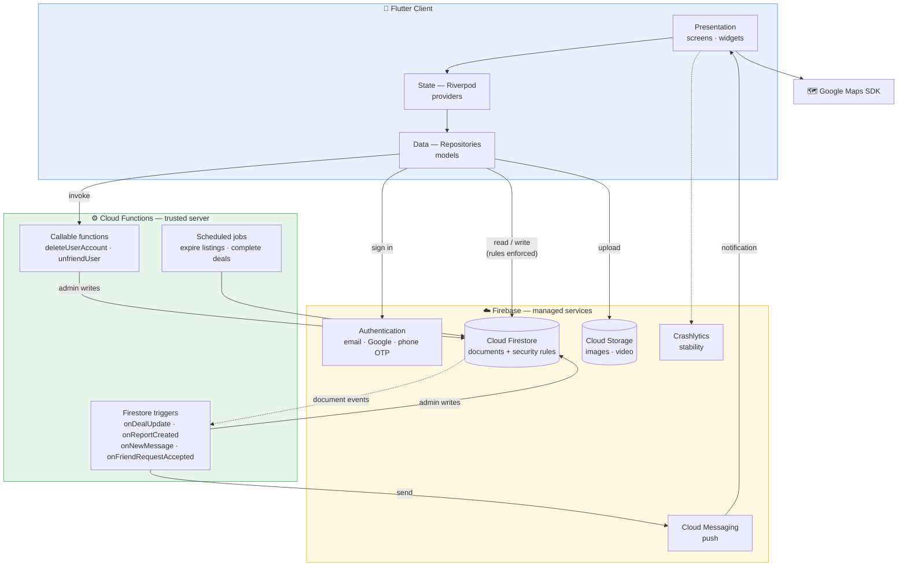
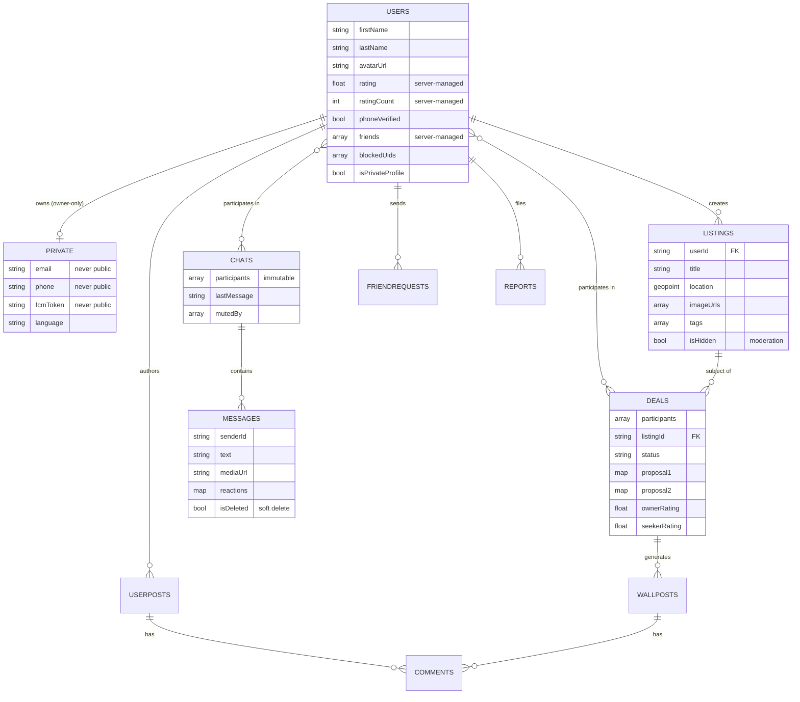
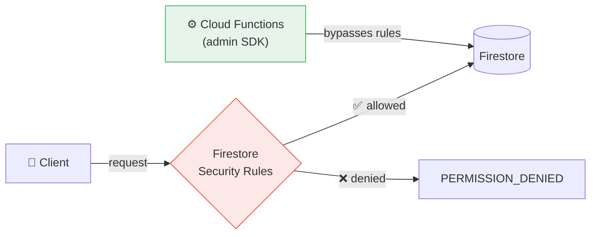
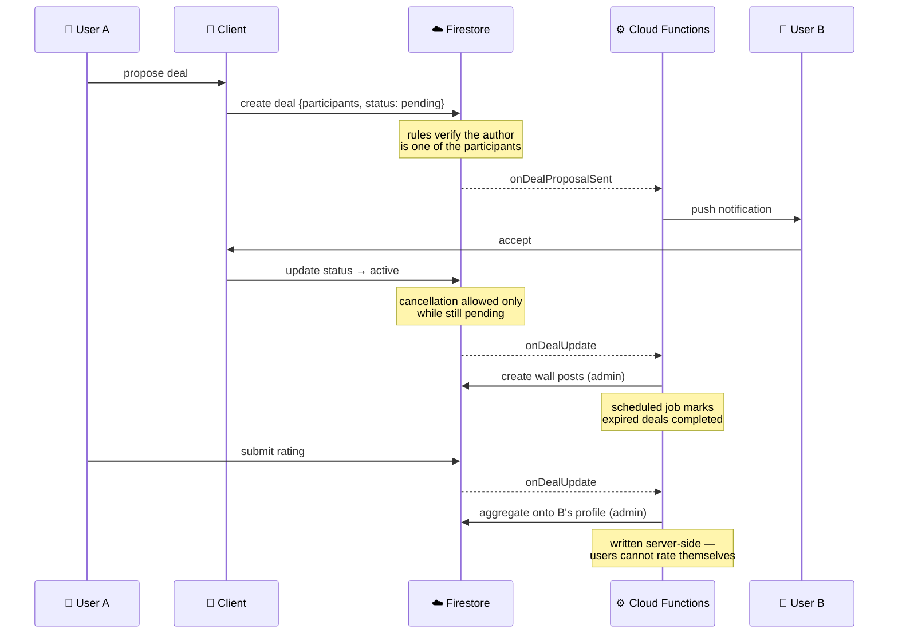
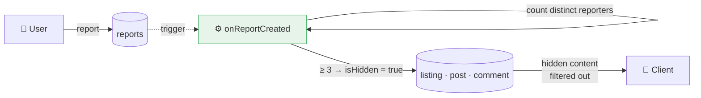

# ShareIt — Architecture

Peer-to-peer marketplace for lending and exchanging items and services within
local communities. Flutter client, serverless Firebase backend.

**Live on Google Play** · [play.google.com/store/apps/details?id=com.ChrisK.shareit](https://play.google.com/store/apps/details?id=com.ChrisK.shareit)

---

## 1. System architecture

How the client, the managed services and the server-side logic fit together.



**Key decision — why Cloud Functions at all.** Anything a user must not be able
to forge runs server-side with admin privileges: ratings aggregation, friendship
writes, report counters and takedown, account deletion. The client is never
trusted with those, and the security rules deny them outright.

---

## 2. Data model

Firestore is document-based, so this is the logical shape rather than a
relational schema.



**Key decision — the `private` subcollection.** Firestore has no field-level read
filtering: any rule that lets a user read a profile hands them the *entire*
document. Email, phone and device tokens therefore live in
`users/{uid}/private/data`, readable only by its owner, while the public profile
document holds nothing sensitive.

---

## 3. Security model

Rules are the real access-control layer, not the UI.



| Enforced rule | Why |
|---|---|
| `private/**` readable only by owner | Prevents mass harvesting of emails and phone numbers |
| `chats.participants` immutable | Stops a participant adding a third party and exposing history |
| Queries must prove membership | Rules filter nothing — an unprovable query is rejected whole |
| `rating`, `friends`, `reportCount` server-only | Removes rating farming and self-added friendships |
| Messages: sender-only soft delete, no undelete | History cannot be silently rewritten |
| `phoneVerified` requires a genuine `phone_number` auth claim | A patched client cannot self-declare as verified |

Rules are covered by an **automated test suite (77 tests)** run against the
Firestore emulator before every deploy — each test asserts both that an attack
is rejected *and* that the legitimate flow still works.

---

## 4. Key flow — proposing and accepting a deal

Shows how client, rules and server-side triggers cooperate.



---

## 5. Content moderation

Required by Play policy for any app carrying user-generated content.



Counting *distinct* reporters rather than raw reports matters: counting reports
would let a single malicious account file three of them and take down anyone's
content.

---

## 6. Project structure

Feature-first: each feature owns its data, state and presentation layers.

```
lib/
├── core/            # shared services, widgets, constants, utils
└── features/
    ├── auth/        # sign-in, registration, phone verification
    ├── listings/    # create, edit, browse, detail
    ├── map/         # geolocated listing map
    ├── feed/        # paginated listing feed
    ├── chat/        # real-time messaging
    ├── deals/       # agreement flow and ratings
    ├── profile/     # profiles, posts, comments, friends
    ├── report/      # content reporting
    ├── notifications/ · saved/ · search/ · settings/

shareit-functions/   # Cloud Functions — deals, moderation (JS)
push-notifications/  # Cloud Functions — messaging, account lifecycle (TS)
firestore-tests/     # security-rules test suite (77 tests)
```

Each feature follows `data/` (models, repositories) → `providers/` (Riverpod
state) → `presentation/` (screens, widgets), so a feature can be understood, or
removed, in isolation.

---

## Stack

**Client** Flutter · Dart · Riverpod · go_router · Google Maps · Geolocator
**Backend** Firestore · Firebase Auth · Cloud Storage · Cloud Messaging · Cloud Functions (Node.js, TypeScript) · App Check · Crashlytics
**Release** 3 locales (el / en / es) · 24 countries · GDPR-compliant data handling
